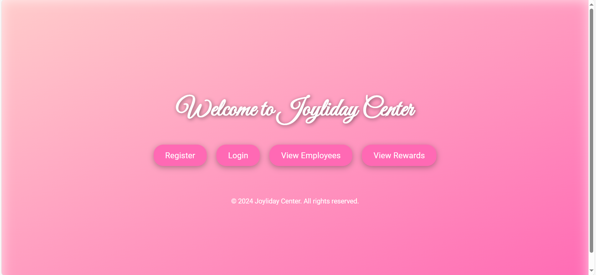

# 🎯 Joyliday - Employee Management System

ระบบจัดการพนักงานและสมาชิก 🎉  
ใช้ **Flask + MySQL** รองรับ CRUD Operations  

## 🛠 Tech Stack
- **Backend:** Flask (Python)
- **Database:** MySQL
- **Frontend:** HTML, CSS, Bootstrap
- **Tools:** VS Code, Anaconda, GitHub

## 🎥 Demo Video
[![Watch the video]

👉 ดูวิดีโอได้ที่ [Google Drive](https://drive.google.com/file/d/1kcrTKREejmyg2Fo946VTjcgNLksZBA-P/view)

## 📸 Screenshots
### 🔹 หน้าแรก (Home Page)


### 🔹 สมัครสมาชิก (Register Page)


### 🔹 เข้าสู่ระบบ (Login Page)


### 🔹 เข้าสู่ระบบ (Login Page)


### 🔹 เข้าสู่ระบบ (Login Page)


## 🚀 วิธีรันโปรเจกต์
```sh
git clone https://github.com/Dinx03/Joyliday.git
cd Joyliday
pip install -r requirements.txt
python app.py
